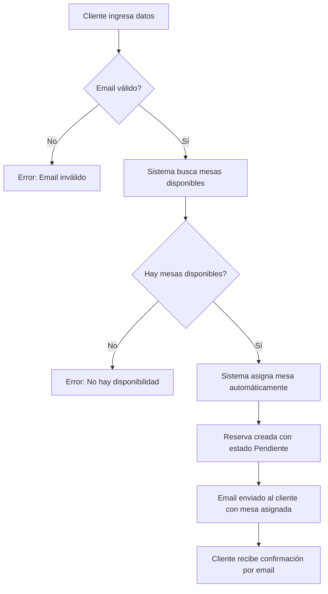

# 🎯 Mejoras Implementadas en el Sistema de Reservas

## 📋 Resumen Ejecutivo

Se ha implementado un sistema de reservas mejorado con las siguientes características principales:

✅ **Validación de email mejorada**  
✅ **Asignación automática de mesas**  
✅ **Prevención de reservas duplicadas**  
✅ **Notificación por email con mesa asignada**  
✅ **Interfaz simplificada para el cliente**

---

## 🔧 Cambios Implementados

### 1. **Validación de Email Mejorada**

#### Backend - Controller (`backend/src/controllers/reservas.controllers.js`)
```javascript
// Validar formato de email antes de procesar la reserva
const emailRegex = /^[^\s@]+@[^\s@]+\.[^\s@]+$/;
if (!emailRegex.test(email)) {
  return res.status(400).json({
    success: false,
    mensaje: 'Por favor ingrese un email válido'
  });
}
```

#### Backend - Schema (`backend/src/models/reservaSchema.js`)
```javascript
email: {
  type: String,
  required: [true, 'El email es obligatorio'],
  trim: true,
  lowercase: true,
  validate: {
    validator: function(value) {
      const emailRegex = /^[^\s@]+@[^\s@]+\.[^\s@]+$/;
      return emailRegex.test(value);
    },
    message: 'Por favor ingrese un email válido'
  }
}
```

**Beneficios:**
- ✅ Validación en doble capa (controller + schema)
- ✅ Formato estricto que previene errores comunes
- ✅ Mensajes de error claros para el usuario

---

### 2. **Asignación Automática de Mesas**

#### Lógica Implementada

El sistema ahora asigna mesas automáticamente siguiendo este algoritmo:

1. **Obtener reservas existentes** para la fecha y hora solicitada
2. **Identificar mesas ocupadas** en ese horario
3. **Buscar mesas disponibles** con capacidad suficiente
4. **Asignar la mesa más pequeña adecuada** (optimización de recursos)

```javascript
// Obtener mesas reservadas para esa fecha y hora
const reservasExistentes = await Reserva.find({
  fecha: fechaReserva,
  hora: hora,
  estado: { $in: ['Pendiente', 'Confirmada'] }
});

const mesasOcupadasIds = reservasExistentes
  .filter(r => r.mesa)
  .map(r => r.mesa.toString());

// Buscar mesa disponible automáticamente
const todasLasMesas = await Mesa.find().sort({ capacidad: 1 });

const mesasDisponibles = todasLasMesas.filter(mesa => {
  const estaOcupada = mesasOcupadasIds.includes(mesa._id.toString());
  const tieneCapacidad = mesa.capacidad >= comensales;
  return !estaOcupada && tieneCapacidad;
});

// Elegir la mesa más pequeña que sea adecuada
mesaAsignada = mesasDisponibles[0];
```

**Beneficios:**
- ✅ El cliente no necesita elegir mesa
- ✅ Optimización automática de la capacidad del restaurante
- ✅ Mejor experiencia de usuario (menos decisiones)
- ✅ Prevención de conflictos de reservas

---

### 3. **Prevención de Reservas Duplicadas**

#### Validación de Disponibilidad

```javascript
// Verificar si ya está reservada (cuando se especifica mesa manualmente)
if (mesasOcupadasIds.includes(mesaAsignada._id.toString())) {
  return res.status(409).json({
    success: false,
    mensaje: `La mesa ${numeroMesa} ya está reservada para esa fecha y hora. 
              Por favor elige otra mesa o un horario diferente.`
  });
}

// Si no hay mesas disponibles
if (mesasDisponibles.length === 0) {
  return res.status(409).json({
    success: false,
    mensaje: 'Lo sentimos, no hay mesas disponibles para esa fecha y hora. 
              Por favor intenta con otro horario.'
  });
}
```

**Beneficios:**
- ✅ Imposible reservar una mesa ya ocupada
- ✅ Mensajes claros cuando no hay disponibilidad
- ✅ Sugerencias al usuario para elegir otro horario

---

### 4. **Notificación por Email con Mesa Asignada**

#### Template de Email Actualizado

El sistema ya incluye el número de mesa en el email de confirmación:

```html
${reserva.numeroMesa ? `
<div class="info-row">
  <span class="info-label">🪑 Mesa:</span>
  <span class="info-value">Mesa ${reserva.numeroMesa}</span>
</div>
` : ''}
```

#### Respuesta del API Mejorada

```javascript
const mensajeExito = mesaAsignada 
  ? `¡Reserva creada exitosamente! Se te ha asignado la Mesa ${mesaAsignada.numero}. 
     Te enviaremos un email de confirmación con todos los detalles.`
  : 'Reserva creada exitosamente. Te enviaremos un email de confirmación.';

res.status(201).json({
  success: true,
  mensaje: mensajeExito,
  reserva: nuevaReserva,
  mesaAsignada: mesaAsignada ? {
    numero: mesaAsignada.numero,
    capacidad: mesaAsignada.capacidad,
    ubicacion: mesaAsignada.ubicacion
  } : null
});
```

**Beneficios:**
- ✅ El cliente recibe confirmación inmediata de su mesa
- ✅ Información completa en el email
- ✅ Transparencia en la asignación

---

### 5. **Interfaz Frontend Simplificada**

#### Cambios en el Formulario (`frontend/src/pages/Reservas.jsx`)

**Eliminado:**
- ❌ Campo de selección manual de mesa
- ❌ Opción "numeroMesa"

**Agregado:**
- ✅ Mensaje informativo sobre asignación automática
- ✅ Visualización de la mesa asignada en el mensaje de éxito

```jsx
<div className="form-group">
  <div className="info-asignacion-automatica">
    <span className="icon-info">ℹ️</span>
    <p>
      <strong>Asignación automática de mesa:</strong> 
      El restaurante te asignará la mejor mesa disponible según el número 
      de comensales. Recibirás la confirmación con el número de mesa por email.
    </p>
  </div>
</div>
```

**Beneficios:**
- ✅ Proceso de reserva más simple y rápido
- ✅ Menos probabilidad de error del usuario
- ✅ Mejor experiencia móvil

---

## 📊 Flujo de Reserva Actualizado

### Flujo del Cliente



### Flujo del Administrador

```
1. Recibe notificación de nueva reserva pendiente
2. Puede confirmar o modificar la mesa si es necesario
3. Al confirmar, el cliente recibe email de confirmación definitiva
```

---

## 🧪 Pruebas Recomendadas

### Pruebas de Validación de Email

```javascript
// ✅ Válidos
"usuario@ejemplo.com"
"nombre.apellido@empresa.co.ar"
"test+tag@dominio.net"

// ❌ Inválidos
"sin-arroba.com"
"@sinusuario.com"
"usuario@"
"usuario @espacio.com"
```

### Pruebas de Asignación de Mesas

1. **Reserva en horario libre:**
   - Input: 2 comensales, fecha futura
   - Esperado: Mesa asignada automáticamente

2. **Reserva cuando hay pocas mesas:**
   - Input: 8 comensales, fecha popular
   - Esperado: Mesa grande asignada

3. **Sin disponibilidad:**
   - Input: Fecha/hora sin mesas libres
   - Esperado: Error 409 con mensaje claro

### Pruebas de Prevención de Duplicados

1. **Misma mesa, misma fecha/hora:**
   - Crear reserva A (Mesa 5, 20:00)
   - Intentar crear reserva B (Mesa 5, 20:00)
   - Esperado: Error 409

---

## 📁 Archivos Modificados

### Backend
- ✅ `backend/src/controllers/reservas.controllers.js` - Lógica principal
- ✅ `backend/src/models/reservaSchema.js` - Validación de schema
- ℹ️ `backend/src/helpers/emailHelper.js` - Ya incluía mesa en email

### Frontend
- ✅ `frontend/src/pages/Reservas.jsx` - Formulario simplificado
- ✅ `frontend/src/pages/Reservas.css` - Estilos nuevos

---

## 🔐 Buenas Prácticas Aplicadas

### Validación en Múltiples Capas
```
Cliente (HTML5) → Controller (Node.js) → Schema (Mongoose) → Base de Datos
```

### Mensajes de Error Descriptivos
```javascript
// ❌ Malo
"Error al crear reserva"

// ✅ Bueno
"La mesa 5 ya está reservada para esa fecha y hora. 
 Por favor elige otra mesa o un horario diferente."
```

### Optimización de Recursos
```javascript
// Asignar la mesa más pequeña adecuada
// En lugar de desperdiciar una mesa grande para pocos comensales
const mesasDisponibles = todasLasMesas
  .filter(mesa => /* validaciones */)
  .sort((a, b) => a.capacidad - b.capacidad);
```

### Código Documentado
```javascript
/**
 * Crear una nueva reserva
 * - Valida formato de email
 * - Asigna mesa automáticamente
 * - Previene duplicados
 * - Envía email de confirmación
 */
const crearReserva = async (req, res) => {
  // ...
}
```

---

## 🚀 Mejoras Futuras Sugeridas

1. **Sistema de Prioridades:**
   - VIP / clientes frecuentes obtienen mejores mesas
   - Reservas de cumpleaños o eventos especiales

2. **Recordatorios Automáticos:**
   - Email 24h antes de la reserva
   - SMS 2h antes

3. **Sistema de Espera:**
   - Lista de espera cuando no hay disponibilidad
   - Notificación si se libera una mesa

4. **Analytics:**
   - Horarios más populares
   - Tasa de ocupación por día/hora
   - Mesas más solicitadas

5. **Preferencias del Cliente:**
   - Guardar preferencias (ventana, terraza, etc.)
   - Historial de reservas anteriores

---

## 📞 Soporte

Para cualquier consulta sobre estas mejoras:

- **Desarrollador:** Cristian German De La Cruz
- **Email:** cristiangermandelacruz29@gmail.com
- **Fecha de implementación:** 15 de noviembre de 2025

---

## ✅ Checklist de Verificación

- [x] Validación de email en controller
- [x] Validación de email en schema
- [x] Asignación automática de mesas implementada
- [x] Prevención de reservas duplicadas
- [x] Email incluye mesa asignada
- [x] Frontend sin campo de selección de mesa
- [x] Mensaje informativo en formulario
- [x] Estilos CSS agregados
- [x] Código documentado
- [x] Buenas prácticas aplicadas

---

**Todas las funcionalidades solicitadas han sido implementadas exitosamente.** ✅
